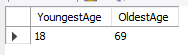
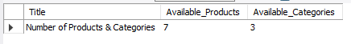
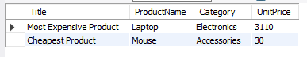
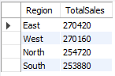
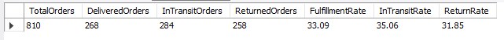
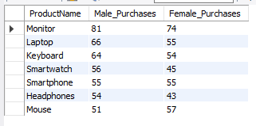
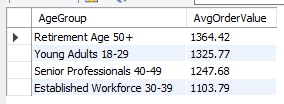
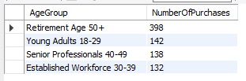
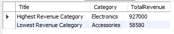
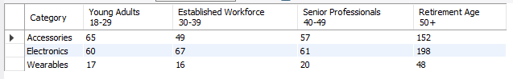

# Data Analysis Hackathon 2025: E-commerce Sales and Customer Insights

#### **May, 2025** 
#### **By Mr. Jefferson Mwatati**
I designed this hackathon to empower my university learners with hands-on experience in data analysis using tools like Excel, SQL, Python, and Power BI. Learners will analyze an E-commerce Sales and Customer Insights Dataset to uncover trends, answer key business questions, and create actionable insights.

## Introduction

**Hackathon Questions** 
***Sales Analysis*** 
    1. What are the total sales by region? 
    2. Which product category generates the highest revenue? 
    3. What is the average shipping fee by region? 
     
***Customer Behaviour*** 
    1. How does customer age impact purchasing behavior? 
    2. What is the most popular product by gender? 
     
***Order Fulfillment*** 
    1. What is the order fulfillment rate (delivered vs. returned)? 
    2. Are there any trends in shipping status over time? 
     

## Data Cleaning Process

## SQL Analysis

  

  

  

  

  

  

  

  

  

  

  

  

## Python Analysis

  

  

  

  

  

  

  

  

  

## Power BI Dashboard

## Conclusion

