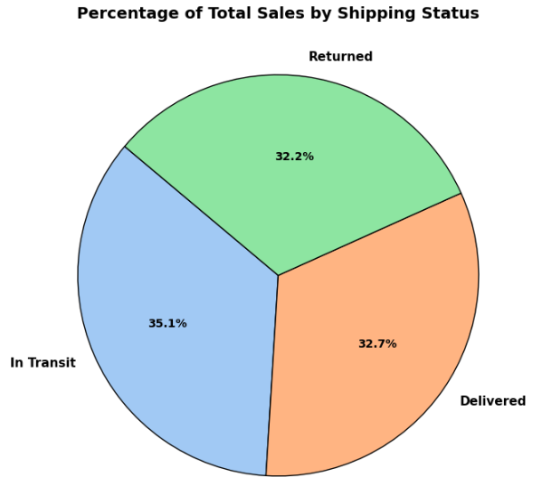
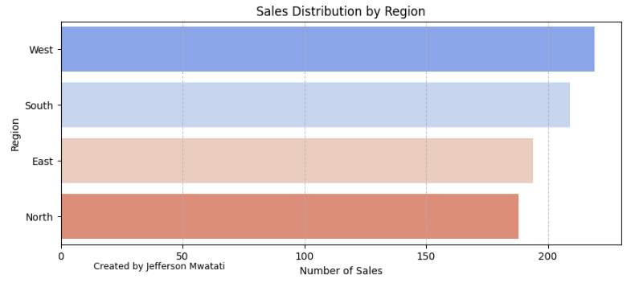

# Data Analysis Hackathon 2025: E-commerce Sales and Customer Insights

#### **May, 2025** 
#### **By Mr. Jefferson Mwatati**
I designed this hackathon to empower my university learners with hands-on experience in data analysis using tools like Excel, SQL, Python, and Power BI. Learners will analyze an E-commerce Sales and Customer Insights Dataset to uncover trends, answer key business questions, and create actionable insights.

## Introduction
The dataset provides information on sales, customer demographics, and order details. It comprises 12 columns: CustomerID, Gender, Region, Age, ProductName, Category, UnitPrice, Quantity, TotalPrice, ShippingFee, ShippingStatus, and OrderDate. Your task is to analyze this dataset, answer the provided questions, and uncover additional insights.

Dataset source: [E-commerce Sales Analysis Hackathon](https://github.com/jeffersonmwatati/E-commerce-Sales-Analysis-Hackathon/blob/64527b0963ecab250ac30d546b2417a0cdfe6f42/raw-dataset-e-commerce-sales-and-customer-insights-dataset.csv)

**Hackathon Questions** 
  
***Sales Analysis*** 
    1. What are the total sales by region? 
    2. Which product category generates the highest revenue? 
    3. What is the average shipping fee by region? 
     
***Customer Behaviour*** 
    1. How does customer age impact purchasing behavior? 
    2. What is the most popular product by gender? 
     
***Order Fulfillment*** 
    1. What is the order fulfillment rate (delivered vs. returned)? 
    2. Are there any trends in shipping status over time? 
     

## Data Cleaning Process
**Using Excel**  
I began by renaming the dataset to a standardized name, **"ecommerce"**, for consistency. Next, I renamed the columns to remove spaces and ensure they followed a uniform naming convention. I then checked and corrected the data types of each column, ensuring accuracy. To maintain uniformity, all numerical columns were formatted to remove decimal places. To handle missing data, I used Excel’s **Filter function** to identify and remove partially empty columns. Initially, the dataset contained **1,000 records**. After removing columns with missing values, the final dataset had **810 records**.

**Using Python**  
To ensure data integrity, I checked for duplicate records using Python. The results showed no duplicates in the dataset: **Total records before: 810**, **Total records after: 810**, **Duplicates removed: 0**

**Using SQL**  
After importing the dataset into a database, I needed to convert the **OrderDate** column from **text** to a **date** format. The rest of the columns already had the correct data types, ensuring smooth data processing.

## SQL Analysis
**Revenue Insights by Category**, The Electronics category generated the **highest revenue, totaling $927,000**, indicating strong customer demand and high-value product sales. In contrast, the Accessories category recorded the **lowest revenue, amounting to $58,580**, suggesting either lower sales volume or lower-priced items within this segment.

  

 
 
**Customer Age Range**, The customer base spans a wide age range, with the **youngest customer aged 18** and the **oldest aged 69**. This indicates a diverse demographic, potentially requiring tailored marketing strategies to engage different age groups effectively.

  

 
 
**Average Order Value by Age Group**, To better understand purchasing behavior, customers were categorized into the following age groups:
+ Young Adults (18–29)
+ Established Workforce (30–39)
+ Senior Professionals (40–49)
+ Retirement Age (50+) 

Analysis of the **average order value** across these groups revealed that **customers aged 50 and above are the highest spenders**, suggesting a higher purchasing power or preference for premium products. Young Adults (18–29) followed closely, while the **Established Workforce (30–39) emerged as the lowest spenders** among all groups. This insight may inform age-targeted marketing and product positioning strategies.

  

 
 
**Number of Purchases by Age Group**, Analyzing the number of purchases across the defined age groups provides further insight into customer behavior. The 50+ age group led significantly with 398 purchases, **demonstrating a strong purchasing capacity**. They were followed by Young Adults (18–29) with 142 purchases, Senior Professionals (40–49) with 138 purchases, and Established Workforce (30–39) with 132 purchases.
**Notably**, the 50+ group made more than double the number of purchases compared to any other group, reinforcing their role as **the most active and valuable customer segment**. This trend highlights the importance of targeting this demographic in marketing and sales strategies.

  

 

**Purchase Distribution by Age Group and Product Category**, The distribution of purchases across age groups and product categories reinforces earlier insights. The 50+ age group **consistently demonstrates the strongest buying power**, making the highest number of purchases across all categories.
Among the product categories, Electronics stands out as the top revenue generator, significantly outperforming Accessories and Wearables. This trend suggests a strong alignment between high-spending customers and high-value products, underlining the importance of **maintaining focus on both the 50+ demographic and the electronics category to maximize revenue potential**.

  

 

**Product Purchases by Gender**, The analysis of product purchases by gender reveals several key insights:
+ The most purchased product is the Monitor, indicating high demand for computing-related accessories.
+ The least purchased product is Headphones, suggesting lower customer interest or possible issues with pricing, visibility, or stock levels.
+ Male customers exhibited a slightly higher purchasing power compared to female customers, reflecting a modest gender-based variation in buying behavior.

Additionally, the data shows that the business has sold only seven distinct product types, highlighting a limited product catalog. This narrow range may restrict growth opportunities and customer engagement. Expanding the product offerings could enhance customer choice and drive increased sales across different customer segments.

  

 
 

**Top Purchased Product by Gender**, The analysis confirms that the **Monitor is the most purchased product** by both male and female customers. Male customers purchased it 81 times, while female customers followed closely with 74 purchases. This consistency across genders highlights the Monitor as a **key product driving sales**, and suggests strong, broad-based demand that could be leveraged in future promotions and inventory planning.

  

 
 

**Order Fulfillment & Delivery Performance Analysis**, A total of 810 orders were recorded, out of which:
+ 268 orders were successfully delivered (**Fulfillment Rate: 33.09%**)
+ 284 orders are still in transit (**In Transit Rate: 35.06%**)
+ 258 orders were returned (**Return Rate: 31.85%**)

These figures indicate significant performance challenges in the order fulfillment and delivery process. **The current fulfillment rate of 33.09% falls far below the industry benchmark of 80% or higher**, suggesting major inefficiencies in processing and delivering orders.

The return rate of 31.85% is also alarmingly high, pointing to **potential issues with product quality, inaccurate descriptions, or unmet customer expectations**.

Furthermore, the in transit rate of 35.06% indicates delays in the delivery process, which could **negatively impact customer satisfaction and brand reputation**. Ideally, this rate should be kept minimal by streamlining logistics and improving delivery speed. Recommendations include conducting a root cause analysis of delivery delays and returns, improving quality control, optimizing supply chain processes, and enhancing customer support during and after purchase.

  

 

**Most Expensive & Cheapest Products**, Among all the products offered, the Laptop is identified as the most **expensive item, priced at $3,110**. In contrast, the Mouse is the **cheapest product, available for just $30**. This wide pricing range reflects a diverse product mix catering to both **high-end and budget-conscious customers**. It also emphasizes the potential for cross-selling opportunities, such as bundling lower-cost accessories with premium items to enhance overall sales value.

  

 

**Total Products & Categories Overview**, The business currently offers a **total of 7 products**, which include: Monitor, Laptop, Keyboard, Smartphone, Mouse, Smartwatch, and Headphones. These products are grouped into **3 main categories**: Electronics, Accessories, and Wearables. While the current catalog provides a foundation across key technology segments, the **limited number of products and categories** suggests a narrow offering that may constrain customer choice and revenue potential. Expanding the product range within each category—or introducing new categories—could help meet diverse customer needs and drive business growth.

  

 

## Python Analysis

**Sales by Gender**, Upon grouping the sales data by gender and calculating the total sales per group, the analysis reveals a notable disparity in purchasing behavior:
+ **Male customers account for 55.8% of the total sales**, indicating a stronger buying power in the current market segment.
+ **Female customers contribute 44.2% of the total sales**, representing a significant but comparatively lower share.
These insights suggest a potential opportunity to explore targeted strategies that can either leverage the strong engagement of male buyers or enhance female customer conversion to achieve a more balanced sales distribution.

  

 

The analysis of total sales distribution across product categories reveals a significant concentration in one segment:
+ **Electronics lead with 88.4% of the total sales**, highlighting this category as the primary revenue driver.
+ **Wearables follow at 6.1%, and Accessories at 5.6%**, both contributing marginally to overall sales.
This indicates a heavy reliance on electronics for revenue, while **Wearables and Accessories exhibit notably low sales performance**, suggesting areas for potential growth or strategic review.

  

 

  

 

  

 

  

 

  

 

  

 

  

 

  

 

## Power BI Dashboard

  

 

  

 

  

 

## Conclusion

