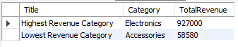
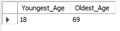
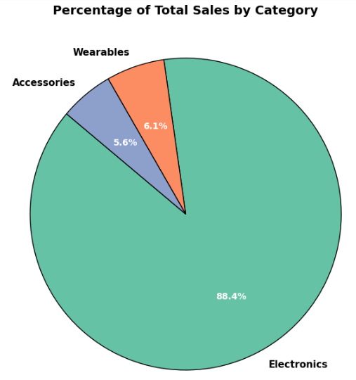
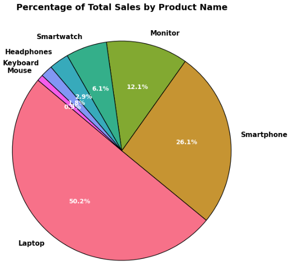
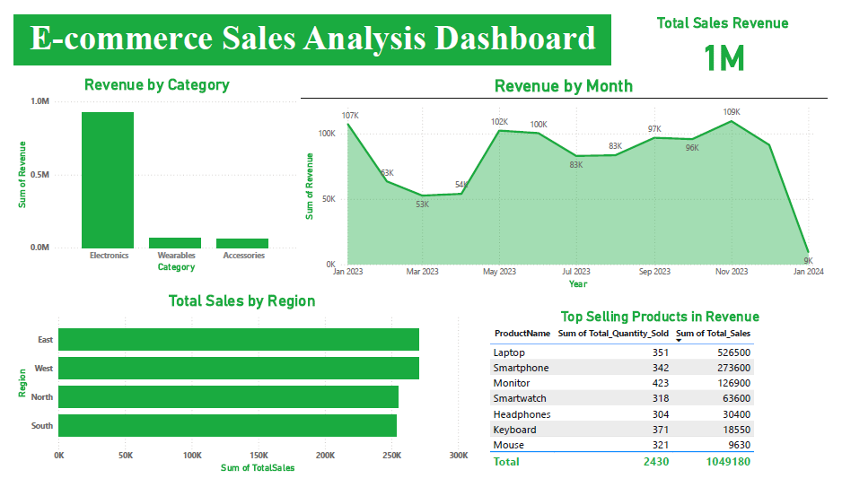

# Data Analysis Hackathon 2025: E-commerce Sales and Customer Insights

#### **May, 2025** 
#### **By Mr. Jefferson Mwatati**
I designed this hackathon to empower my university learners with hands-on experience in data analysis using tools like Excel, SQL, Python, and Power BI. Learners will analyze an E-commerce Sales and Customer Insights Dataset to uncover trends, answer key business questions, and create actionable insights.

## Introduction
The dataset provides information on sales, customer demographics, and order details. It comprises 12 columns: CustomerID, Gender, Region, Age, ProductName, Category, UnitPrice, Quantity, TotalPrice, ShippingFee, ShippingStatus, and OrderDate. Your task is to analyze this dataset, answer the provided questions, and uncover additional insights.

Dataset source: [E-commerce Sales Analysis Hackathon](https://github.com/jeffersonmwatati/E-commerce-Sales-Analysis-Hackathon/blob/64527b0963ecab250ac30d546b2417a0cdfe6f42/raw-dataset-e-commerce-sales-and-customer-insights-dataset.csv)

**Hackathon Questions** 
  
***Sales Analysis*** 
    1. What are the total sales by region? 
    2. Which product category generates the highest revenue? 
    3. What is the average shipping fee by region? 
     
***Customer Behaviour*** 
    1. How does customer age impact purchasing behavior? 
    2. What is the most popular product by gender? 
     
***Order Fulfillment*** 
    1. What is the order fulfillment rate (delivered vs. returned)? 
    2. Are there any trends in shipping status over time? 
     

## Data Cleaning Process
**Using Excel**  
I began by renaming the dataset to a standardized name, **"ecommerce"**, for consistency. Next, I renamed the columns to remove spaces and ensure they followed a uniform naming convention. I then checked and corrected the data types of each column, ensuring accuracy. To maintain uniformity, all numerical columns were formatted to remove decimal places.

To handle missing data, I used Excel’s **Filter function** to identify and remove partially empty columns. 

Initially, the dataset contained **1,000 records**. After removing columns with missing values, the final dataset had **810 records**.

**Using Python**  
To ensure data integrity, I checked for duplicate records using Python. The results showed no duplicates in the dataset:
  - **Total records before: 810**
  - **Total records after: 810**
  - **Duplicates removed: 0**

**Using SQL**  
After importing the dataset into a database, I needed to convert the **OrderDate** column from **text** to a **date** format. The rest of the columns already had the correct data types, ensuring smooth data processing.

## SQL Analysis

  

  

  

  

  

  

  

  

  

  

## Python Analysis

  

  

  

  

  

  

  

  

  

## Power BI Dashboard

  

  

  

## Conclusion

